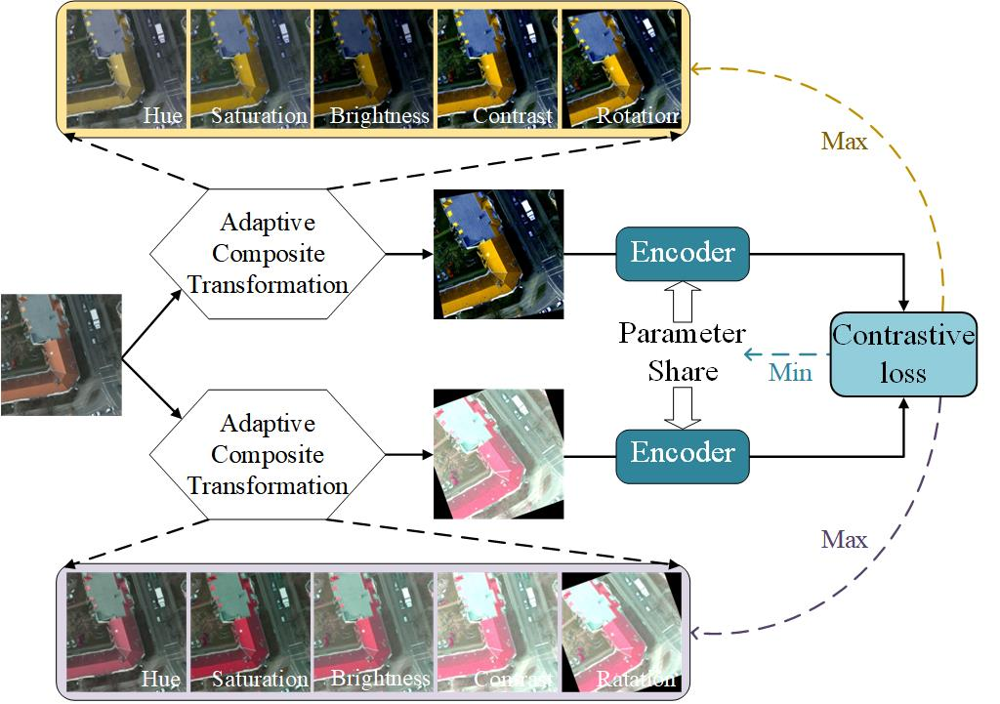

#  Adaptive Multi-type Contrastive Views Generation for 

# Remote Sensing Image Semantic Segmentation




## 1) Install Dependencies

We used the following PyTorch libraries for CUDA 10.1; you may have to adapt for your own CUDA version:

```console
pip install torch==1.7.1+cu101 torchvision==0.8.2+cu101 torchaudio==0.7.2 -f https://download.pytorch.org/whl/torch_stable.html
```

Install other dependencies:
```console
pip install -r requirements.txt
```

## 2) Running experiments

Start by running
```console
python scripts/run_image.py "your config path" --gpu-device 0
```

This command runs attack pretraining on the your dataset using GPU #0. (If you have a multi-GPU node, you can specify other GPUs.)

The `config` directory holds configuration files for the different experiments,  specifying the hyperparameters from each experiment. The first field in every config file is `exp_base` which specifies the base directory to save experiment outputs, which you should change for your own setup.

You are responsible for downloading the datasets. Update the paths in `src/datasets/root_paths.py`.
